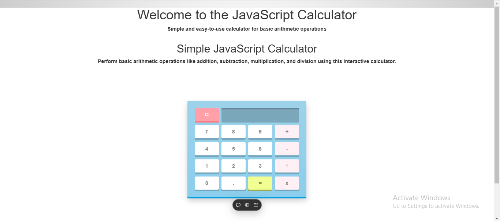

# JavaScript Calculator

A simple, responsive JavaScript calculator that allows users to perform basic arithmetic operations such as addition, subtraction, multiplication, and division.



## Table of Contents
- [Features](#features)
- [Installation](#installation)
- [Usage](#usage)
- [Technologies Used](#technologies-used)
- [Contributing](#contributing)
- [License](#license)
- [Contact](#contact)

---

## Features

- Perform basic arithmetic operations: addition (+), subtraction (-), multiplication (x), and division (÷).
- Clear button to reset the calculator screen.
- Simple and intuitive user interface.
- Responsive design with Bootstrap integration.

---

## Installation

1. **Clone the repository:**
```bash
   git clone https://github.com/kevykibbz/calculator.git
```
2. Navigate to the project folder:
```bash
cd calculator
```
3. Open index.html in your browser.

## Usage

- Enter numbers and operators by clicking the buttons.
- Press the "=" button to calculate the result.
- Use the "C" button to clear the screen.

---

## Technologies Used

- **HTML5**
- **CSS3**
- **JavaScript**
- **Bootstrap 3.3.0**

---

## Contributing

Contributions are welcome! Here's how you can help:

1. Fork the repository.
2. Create a new branch:
```bash
git checkout -b feature-name
```
3. Make your changes and commit them:
```bash
git commit -m 'Add some feature'
```
4. Push to the branch:
```bash
git push origin feature-name
```
5. Submit a pull request.

## License

This project is licensed under the MIT License - see the [LICENSE](LICENSE) file for details.

---

## Contact

For any questions or feedback, please reach out:

- **Name:** Kevin Kibebe 
- **Email:** kibebekevin@gmail.com 
- **GitHub:** htps://github.com/kevykibbz  

---

## Live Demo

[Click here to see the live demo](https://calculator-lime-eight-47.vercel.app/)  


